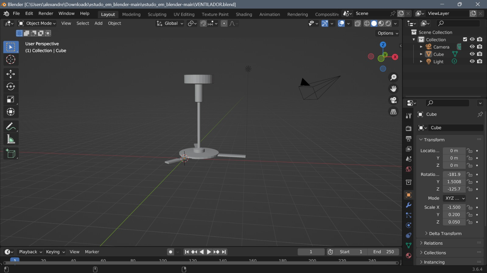
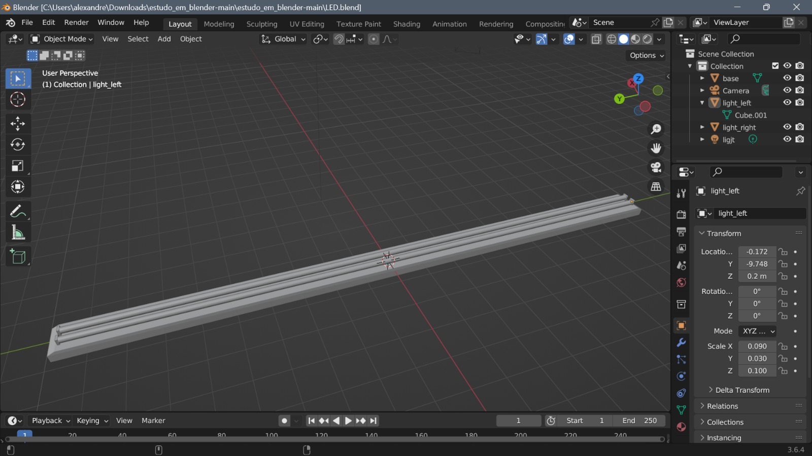
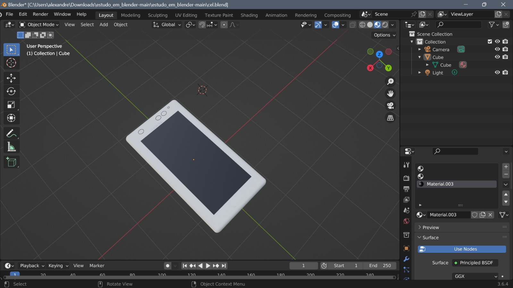

# Blender Study

This repository contains the results for a some 3D models made by me on Blender, a popular open-source 3D computer graphics software used for creating animated films, visual effects, art, 3D games, and more.

## Overview

Blender is a powerful and versatile tool for 3D modeling, rendering, animation, and more. This study explores various aspects of Blender, including its features, capabilities, and practical applications.

## Getting Started

Before diving into the study, make sure you have Blender installed on your system. You can download it from the official [Blender website](https://www.blender.org/download/).

Clone this repository to your local machine to access the study materials and resources:

```shell
git clone https://github.com/rcampos1970/blender-study.git
```

## Resources

- [Blender Documentation](https://docs.blender.org/): Official documentation for Blender.
- [Blender Artists Community](https://blenderartists.org/): A community forum for Blender users.
- [Blender Guru](https://www.blenderguru.com/): Tutorials and resources for Blender enthusiasts.
- [Blender Stack Exchange](https://blender.stackexchange.com/): Q&A site for Blender-related questions.


## Author

- [Rafael Campos Oviedo](https://github.com/rcampos1970)

Feel free to reach out if you have any questions or suggestions related to this study.

Happy blending!


<table>
  <tr>
    <td></td>
    <td></td>
    <td></td>
  </tr>
</table>
